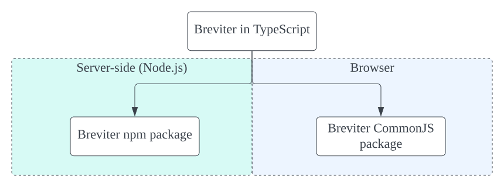
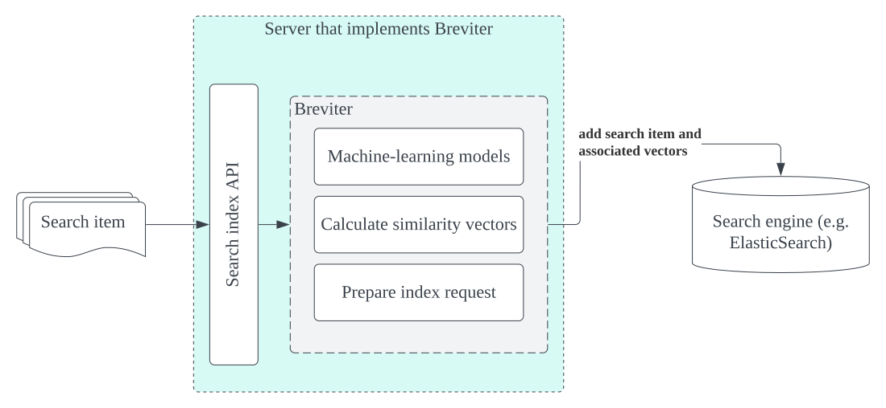
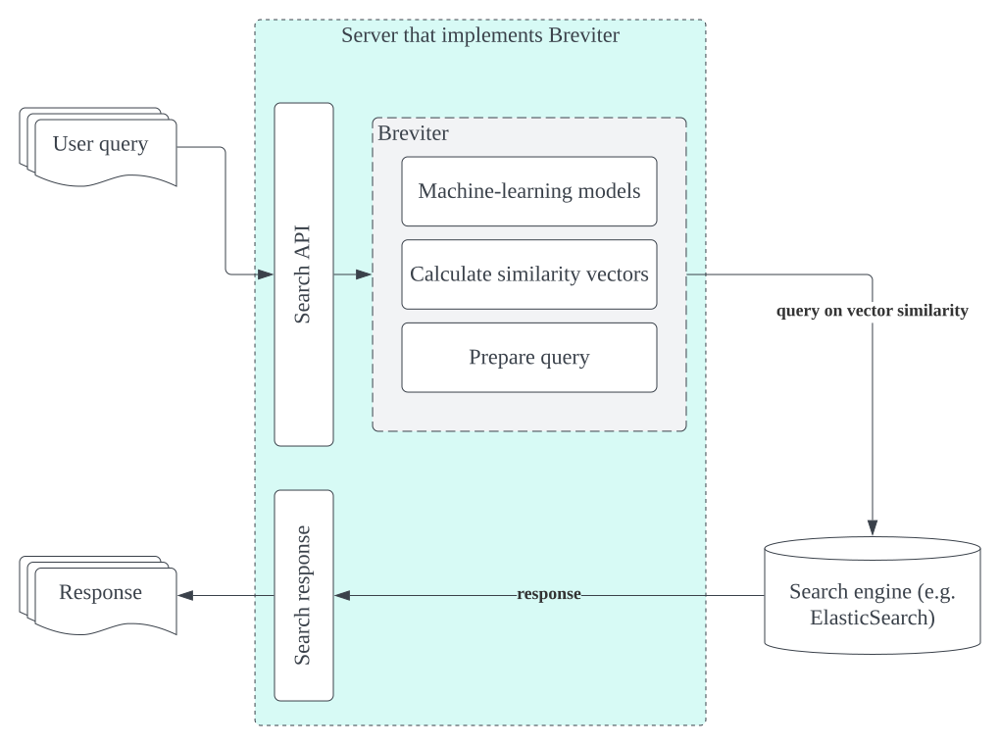
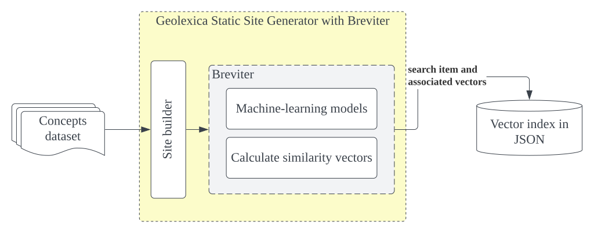
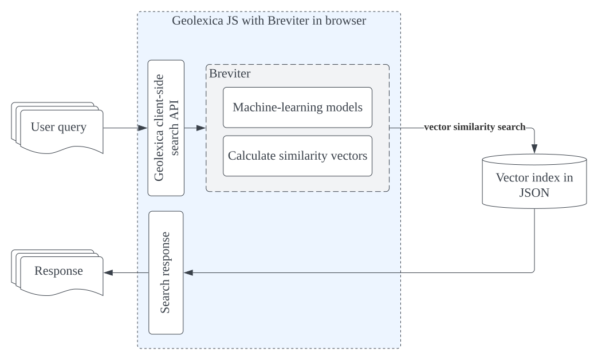
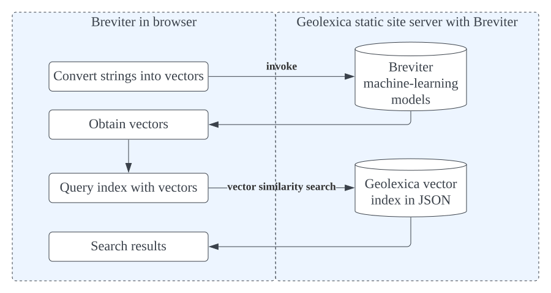

= Technical Report: Breviter for Geolexica Reverse Semantic Search
Geolexica Team
2022-09-30

== Introduction

Ever forgotten a specific word but could describe its meaning?

Internet search engines more than often return unrelated entries.
The solution is *reverse semantic search*: given an input of the meaning of the
word (search phrase), provide an output with dictionary words that match the
meaning.
The key to accurate reverse search lies in the machine's ability to understand
semantics.
We employ deep learning approaches in natural language processing (NLP) to
enable better comparison of meanings between the search phrases with word
definitions.
Accuracy will be significantly increased.
The ability to identify entities with similar semantics facilitates ontology
discovery in the Semantic Web and in Technical Language Processing (TLP).

The project outcome is now deployed in project on the
https://isotc211.geolexica.org[ISO/TC 211 Geolexica] as a pilot application and
testbed for evaluation.

== Contributors

Implementation team members include:

* Jeffrey Lau, Ribose
* Nick Nicholas, Ribose
* Anton Strogonoff, Ribose

Testing team members include:

* Reese Plews, Convenor, ISO/TC 211 Terminology Management Group
* Ronald Tse, Ribose

== Deliverables

Deliverable 1:: Testing dataset (see <<test-datasets>>)

Deliverable 2:: The search engine implementation (see <<implementation>>)

Deliverable 3:: Geolexica application (refer to Deliverable 2)

Deliverable 4:: Testing and benchmarking (results <<test-results,detailed below>>)

[[test-datasets]]
== Testing datasets (Deliverable 1)

=== General

The testing datasets are provided under
https://github.com/geolexica/breviter/tree/main/public/test_cases[`public/test_cases`^]
in https://github.com/geolexica/breviter[^].

There are two testing datasets:

. Search queries generated by Geolexica users. This is an empirical dataset
collected by the Convenor of the ISO/TC 211 Terminology Management Group.

. Search queries generated by semantic cleansing. This is a synthetic dataset.

[[test-dataset-users]]
=== Search queries generated by Geolexica users

The filename is `public/test_cases/test-iso-tc211.txt`.

The ISO/TC 211 Terminology Management Group Convenor, who is the register owner
of the ISO/TC 211 Geolexica dataset, has gathered this real-life dataset from
Geolexica users for realistic search queries on how users would search for a
particular term by meaning when they forgot what the term was. The Geolexica
users solicited are experts in the geographic information domain.

This is a particular important use case in the field of standardization of
geographic information, as there are many field-specific terms with definitions
that differ from the normal language understanding.

For example, the term "nadir" means "a point below a position", which differs
from the typical understanding that "nadir" means the "lowest point".

There are 106 queries in this dataset.

[[test-dataset-cleaned]]
=== Search queries generated by semantic cleansing

The filename is `public/test_cases/test-iso-automatic.txt`.

It is established that translation engines lose semantic information during a
translation process. This loss is especially pronounced between language-pairs
that are semantically distant, have less direct translation data or require
translation bridging through a third language, such as between Japanese and
Arabic.

This effect is often observed by translating a word from a language to another,
only to see that the reverse translation gives back another word different
from the original.

The first dataset is generated by using this property of semantic loss to
implement semantic cleansing, which is the process to obtain a generic search
query that loses the syntax but retains some semantics.

In particular, this dataset is built by applying semantic cleansing on the definitions
of the ISO/TC 211 Geolexica concept dataset, by passing its definitions
through the following language pairs on Google Translate:

* English to Spanish
* Spanish to Chinese
* Chinese to English
* English to Arabic
* Arabic to Finnish
* Finnish to French
* French to Portuguese
* Portuguese to English

There are 1,302 queries in this dataset.

// The search queries of the dataset are shown to contain the desired properties
// for this experiment.

[[implementation]]
== Breviter and Geolexica (Deliverable 2 and 3)

=== General

The Breviter library has been developed and is now deployed on the
https://isotc211.geolexica.org[ISO/TC 211 Geolexica site], located at:

* https://isotc211.geolexica.org/_next/server/pages/reverse.html[Geolexica: Reverse semantic search].

For those who wish to adopt Breviter, please refer to
documentation of the Breviter library, at:

* https://github.com/geolexica/breviter

=== Goals

The Breviter implementation aims to satisfy the following goals:

. Provide a reverse semantic search framework that works on static sites without
requiring dedicated server resources, which is important for site resiliency and
availability.

. Project a reverse semantic search framework that works on both browser-side
and server-side using shared code.

. Provide a reverse semantic search framework that works for multiple languages.

. Implement the resulting reverse semantic search framework on Geolexica for
ISO/TC 211, which holds the authoritative terminology dataset for geographic
information.

=== Implementation and availability

Breviter is implemented as a TypeScript application located at
https://github.com/geolexica/breviter.

TypeScript was chosen as the deployment platform due to the ease of executing
the necessary machine-learning models in the browser as well as on the
server-side through Node.js.

Currently, Breviter is a single TypeScript library that runs on the following
platforms:

* in browser, as deployed on https://isotc211.geolexica.org;
* in Node.js, as a package to be imported by a server-side program.

The corresponding library packages are provided on NPM and CommonJS for those
scenarios.

.Library packages for different deployment options

Breviter uses machine-learning models in the following manner:

* Breviter uses Tensorflow.js, which is the JavaScript version of Tensorflow,
to prefer search indexing preparation and query pre-processing.

=== Architecture and process

==== Deployment options

Breviter can be deployed in two ways for semantic search:

* in browser, it can be deployed using JavaScript that loads the Breviter
library through RequireJS;

* on the server-side, it fulfills both necessary roles below:

** as a pre-processor prior to search indexing, in order to insert vectors
into a search engine that supports them (e.g. ElasticSearch)

** as a pre-processor prior to querying, in order to calculate
vectors for a vector similarity query on a search engine (e.g. ElasticSearch)
that supports them.

==== Server-side deployment of Breviter

When used on the server-side, Breviter is needed for both the indexing and
querying processes. Server-side here means the usage of a persistent search
engine, such as ElasticSearch, that provides a web-accessible search API.

In server-side mode, Breviter needs to be integrated at the indexing stage,
where the definitions are converted into vectors using the machine-learning
model by Breviter, and those vectors are inserted into the search index (for
future search queries).

.Server-side indexing process with Breviter

In server-side mode, Breviter also has to be integrated at the querying stage,
where the search query is converted into vectors and then queried against
the vector search index built in the indexing step. The results returned
will contain the closest vector matches between the search queries and the
definitions.

.Server-side query process with Breviter

==== Client-side deployment of Breviter

The client-side deployment of Breviter involves running machine-learning
models on the client-side, as in, the browser environment.

This deployment mode is necessary to support the deployment of Breviter on
Geolexica, which adopts a static serverless structure with a precomputed set of
static data built using a static site generator (SSG).
The resulting static site is hosted on a "dumb" HTTPS server which only performs
limited functionality for serving files.

The benefits of the static serverless structure are many, including:

* enhanced site resilience as there are no server-side components that are
easily compromised;

* reduced resourcing in its regular upkeep;

* ability to move all components to CDNs of which provide local speeds
for site users.

Geolexica employs a pre-computed search index with a browser-side search
component.

In browser-side mode, the indexing process involves using Breviter locally (on
the static site generation side) to pre-calculate vectors to generate the static
search index.

.Browser-side indexing process with Breviter

In browser-side mode, the querying process involves using Breviter in the browser
to calculate vectors for the search query, and applies a vector search process
in the static search index.

.Browser-side query process with Breviter

The browser-side Breviter component interacts with the static search index
and the Breviter machine-learning model located on the static site server,
as shown in the image below.

.Browser-side access to static site server with Breviter

=== Language support

Breviter currently only supports the English language due to the availability
of machine-learning models.

For English, Breviter utilizes the https://research.google/pubs/pub49111/[Google MobileBERT]
model on Tensorflow.js to perform sentence similarity comparisons. MobileBERT
was selected as it is a minimally-sized BERT model that performs at a high
accuracy compared to the pre-distillation model, despite it being only 25MB in
total in a sharded format.

One key goal in Breviter is to allow usage of semantic search on mobile devices
while not requiring a server-side search instance. Support for Breviter in
Geolexica for the other languages (Geolexica supports 14 languages) is not
provided as there is limited experience with distilling non-English BERT-like
models into smaller sizes suitable for mobile devices. For example,
https://camembert-model.fr[Camembert], a state-of-the-art BERT model for French
has a size of 965.72M in compressed format, which is too resource intensive for
mobile devices to utilize on browser side.

[[extend-languages]]
=== Extending language support

It is possible to extend Breviter to work with other languages, given that
various string vectorization models are available for those particular languages,
keeping in mind the deployment goals of Breviter.

The method to extend Breviter to a new language on Geolexica is as follows:

. (optional) If the model is to be also useable on the client-side (browser-side),
it is necessary to distill the model down to a size suitable for mobile use.
The techniques of distilling a BERT model are established through notably
https://arxiv.org/abs/1910.01108[DistillBERT] and
https://arxiv.org/abs/2004.02984[MobileBert], however, non-English distillation
requires further research.

. Convert the string vectorization model into the Tensorflow.js format. The
necessary steps for conversion are
https://www.tensorflow.org/js/tutorials/conversion/import_saved_model[documented]
at the Tensorflow.js website.

. Add the desired model in a sharded format (in 4MB files), into the underlying
static site server under the `public/` directory (this is done within the
Breviter repository).

. Add the language configuration and the corresponding model name in Breviter.

. In Geolexica, make the additional language available on the "Semantic search"
page.

== Testing and benchmarking (Deliverable 4)

=== General

Testing and benchmarking was performed on the Breviter library with
results <<test-results,detailed below>>.

Both test datasets (<<test-datasets>>) were used to compare performance between
Breviter's reverse semantic search algorithm against typical keyword search
offered by ElasticSearch that uses the Okapi BM25 algorithm.

=== Evaluation method

==== Overview

* A overall fit score (normalized) is calculated for each test dataset and search method.
* This score is then used for comparison in the evaluation phase.
* The higher the score, the more accurate the result is.
* The score is ranged from 0 to 1.

=== Test methodology and score calculation

==== Dataset format

Each dataset is a plaintext file,
each row consisting of a query string,
followed by a comma,
followed by the expected result.

==== Test methodology

For each combination of dataset and search method,
for each query in the dataset,
feed it into the search method,
and receive an ordered list of output words.

The order of the expected word within the list is the resulting *rank*,
which is used to calculate the aggregate score for the dataset and search method
combination.

The aggregate scores are then normalized against the dataset size.
These normalized scores are compared with each other in order to
compare relative accuracy.
The higher the score (closer to 1.0),
the more accurate the search method is, for the given dataset.

The two search methods are:

. Semantic search using computed Breviter data, loaded into Elasticsearch
for vector search;

. Keyword (fuzzy) matching search using ElasticSearch (with the default Okapi
BM25 algorithm).

==== Aggregate score

It is a weighted arithmetic mean of the number of inputs achieving a certain
rank range, multiplied by the corresponding score:

* A, *rank 1:*  score 20
* B, *rank 2-3:*  score 10
* C, *rank 4-5:*  score 5
* D, *rank 6-10:*  score 3
* E, *rank 11-20:*  score 1
* F, *all other ranks:*  score -3

NOTE: The rank of "200" is assigned to inputs that are not included in the
returned search results.

[source]
----
normalized score = (20×A + 10×B + 5×C + 3×D + 1×E + -3×F) / (20 × (A + B + C + D + E))
----

=== Reproduction of test scores

==== Using Elasticsearch

* Install prerequisites: NodeJS 16+, yarn, Ruby 2.7+, Docker (remember to start Docker)

* Install project
+
[source,console]
----
$ git clone --recurse-submodules https://github.com/geolexica/breviter-compare
$ cd breviter-compare
$ make update
----

* Prepare the test file. The file must be located at `test-cases.txt`. Change
the file to load different test cases.

* Start elasticsearch server:
+
[source,console]
----
$ make setup_docker
----

* Load into elasticsearch server:
+
[source,console]
----
$ make setup_elasticsearch
----

* Build models and run tests:
+
[source,console]
----
$ make test_search
----

==== Using a browser

===== Setup Breviter (as a server)

* Install prerequisites: NodeJS 16+, yarn, Ruby 2.7+

* Install project
+
[source,console]
----
$ git clone https://github.com/geolexica/breviter
$ cd breviter
$ yarn
----

* Build model
+
[source,console]
----
$ yarn compute
----

* Run the interactive server (which will run by default at http://localhost:3000)

[source,console]
----
$ yarn dev
----

===== Executing test cases (in the browser)

* Open the browser and go to http://localhost:3000/testing .
* Click on `Browse...` button to select a test case file.
* Let it run and display results.

[[test-data-preparation]]
=== Test data preparation

The test dataset files can be found under
https://github.com/geolexica/breviter/tree/main/public/test_cases[`public/test_cases`]
of https://github.com/geolexica/breviter[^].

Control dataset::
https://github.com/geolexica/breviter/tree/main/public/test_cases/test2.txt[`test2.txt`]
This synthetic dataset is the control, which is unmodified from the source
definitions from the ISO/TC 211 Geolexica concepts database.

Dataset 1 (real-life dataset)::
https://github.com/geolexica/breviter/tree/main/public/test_cases/test-iso-tc211.txt[`test-iso-tc211.txt`]
This dataset is gathered by the terminology coordinator of ISO/TC 211
as per <<test-dataset-users>>.

Dataset 2 (synthetic dataset)::
https://github.com/geolexica/breviter/tree/main/public/test_cases/test-iso-automatic.txt[`test-iso-automatic.txt`]
This dataset is generated using the automatic procedure specified in
<<test-dataset-cleaned>>.

[[test-results]]
=== Test Results

==== Dataset 1 (real-life dataset)

Fit score for Breviter:

* "Score_BR = (20×35 + 10×23 + 5×16 + 3×12 + 1×3 + -3×17) / 2120 = 0.4707547169811321"

Fit score for keyword search:

* "Score_KS = (20×21 + 10×17 + 5×7 + 3×17 + 1×9 + -3×35) / 2120 = 0.27358490566037735"

Improvement:

* stem:[(Score_BR - Score_KS) / Score_BR * 100% = 41.88%]

[cols="a,a,a",options="header"]
|===
| 2+| Results
| Rank | Semantic search | Keyword search
| A | 35 | 21
| B | 23 | 17
| C | 16 | 7
| D | 12 | 17
| E | 3  | 9
| F | 17 | 35
|   |    |
| Total | 106 | 106
|===

For
- normalized fit score: 0.9320601851851852

==== Dataset 2 (synthetic dataset)

TODO: Jeffrey.

Fit score for Breviter:

* "Score_BR = (20 × 1178 + 10 × 53 + 5 × 1 + 1 × 64) / 25920 = 0.9320601851851852"

Fit score for keyword search:

* "Score_KS = ..."

Improvement:

* stem:[(Score_BR - Score_KS) / Score_BR * 100% = ...%]

[cols="a,a,a",options="header"]
|===
| 2+| Results
| Rank | Semantic search | Keyword search
| A | 35 | 21
| B | 23 | 17
| C | 16 | 7
| D | 12 | 17
| E | 3  | 9
| F | 17 | 35
|   |    |
| Total | 106 | 106
|===

=== Analysis of results

==== General

From the results of testing against both dataset 1 and dataset 2, it is shown
that the Breviter reverse semantic search approach delivers exceptionally better
results in most scenarios:

* where the search query contains similar but not identical keywords to those
used in the definition

* where the ranked results of a keyword search were ranked too low due to
keyword mismatches

On the other hand, there are certain improvements that could potentially be made
for the Breviter approach. More specifically, the tuning can happen on the
machine-learning models used by Breviter.

Some areas for potential improvement are provided below.

==== Improvement: when model does not understand provide links between similarly used terms

When the search query is "limit of an entity", the entry for "boundary" is returned,
given that its definition is "set that represents the limit of an entity".

When the search query is modified to "limit of an object" or "limit of a thing",
the entry for "boundary" drops out from the top 10 results, as the model scoring
mechanism does not relate the concept of "entity" or "thing" to "object", while
in reality are closely related and often used as synonyms in the field of
geographic information.

Similarly, a search query "splitting into identical spaces" will return the
"tesselation" entry as expected, but "splitting into identical areas" will not,
even though "space" and "area" are closely related words, due to limitations of
the underlying MobileBERT model.

==== Improvement: domain-specific words or acronyms are not easily recognized

BERT models are typically trained on large text corpuses such as Wikidata.
These text corpuses normally do not include domain-specific words or acronyms
that are applied in the field of geographic information.

As a result, given that acronyms like "LIDAR", "SONAR", "GNSS" are considered
outliers of the MobileBERT model, the vectors returned from those words are not
adequately trained and therefore cannot provide predictable results.

== Conclusion

This report documents the implementation of the Breviter reverse semantic search
library implemented and deployed to the ISO/TC 211 Geolexica site.

The resulting library implementation is shown to work both on browser-based
and server-side (Node.js) environments, and are packaged appropriately to
facilitate those scenarios.

This report also provided search performance comparison results by use of
empirical and synthetic datasets.

The Breviter library, associated datasets and reports are all provided in an
open-source manner.

The Geolexica team thanks NLNet for providing a generous grant in support of
this work, on behalf of Geolexica users and the geographic information
community.

In the future, the team aims to extend the Breviter approach on English to
other languages, such as French or Arabic, where BERT approaches are well
described.

== References

* https://github.com/geolexica/breviter[Breviter (implementation)]

* https://github.com/geolexica/breviter-compare[Breviter test report generation]

NOTE: Images used in this report are located here:
https://lucid.app/lucidchart/88c4685c-b4ce-4438-93cb-19b47a8a81f1/
